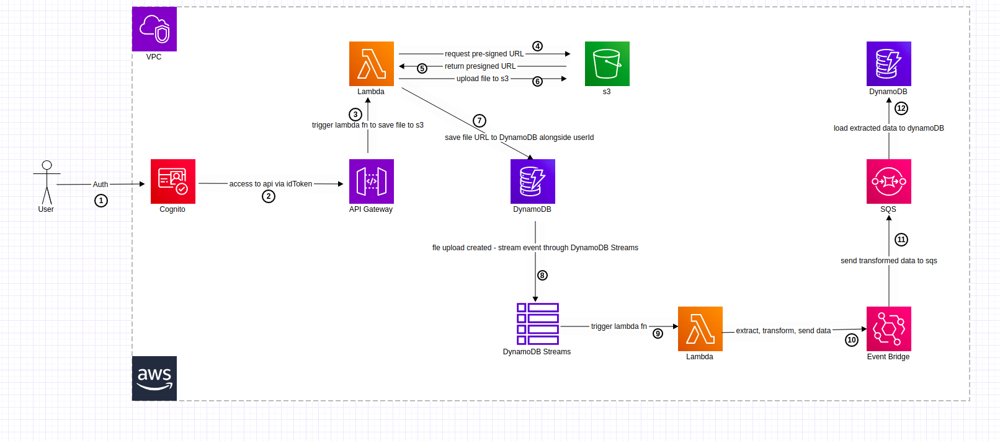

# Serverless ETL

- Adaptation of ts-file upload done serverless on AWS as a CDK project with TypeScript.

## Overview

- Project description similar to the [ts-fileupload](https://github.com/ShadrackAdwera/ts-fileupload)

## Architecture

## AWS Services

- API Gateway
- Cognito
- DynamoDB
- Event Bridge
- Lambda
- SQS
- SNS? Maybe to notify on successful data upload? We shall see . . .

## Useful commands

- `npm run build` compile typescript to js
- `npm run watch` watch for changes and compile
- `npm run test` perform the jest unit tests
- `cdk deploy` deploy this stack to your default AWS account/region
- `cdk diff` compare deployed stack with current state
- `cdk synth` emits the synthesized CloudFormation template
